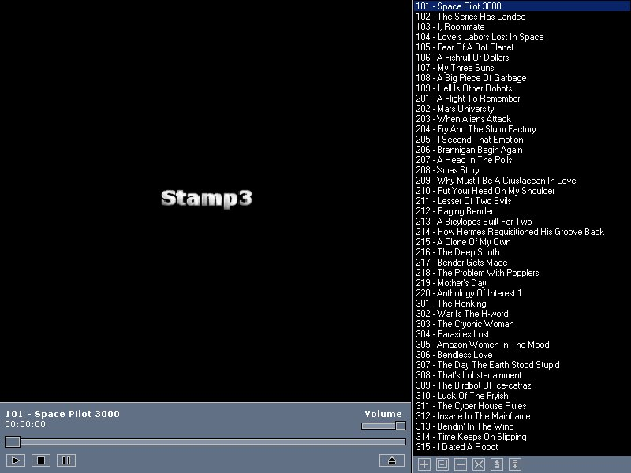



## Stamp3 Videoplayer

### Description

Stamp3 is a full featured Video Player. It supports the major video formats

including .AVI .MPG .ASF and .WMV. Uses DirectShow to render video.

If you want to make .skin files, compiler the skincompiler and copy its .exe into one of the premade skin templatedirectory ("\Fjomp\" and "\Default Skin\"). Run the .exe to make a .skin file, copy that to the "Skins" directory.

Code is not commented.
 
### More Info
 

             |
---                |---
**Submitted On**   |2002-03-30 15:21:28
**By**             |[N/A](https://github.com/Planet-Source-Code/PSCIndex/blob/master/ByAuthor/empty.md)
**Level**          |Advanced
**User Rating**    |5.0 (60 globes from 12 users)
**Compatibility**  |VB 6\.0
**Category**       |[Complete Applications](https://github.com/Planet-Source-Code/PSCIndex/blob/master/ByCategory/complete-applications__1-27.md)
**World**          |[Visual Basic](https://github.com/Planet-Source-Code/PSCIndex/blob/master/ByWorld/visual-basic.md)
**Archive File**   |[Stamp3\_Vid164144952003\.zip](https://github.com/Planet-Source-Code/stamp3-videoplayer__1-48283/archive/master.zip)

